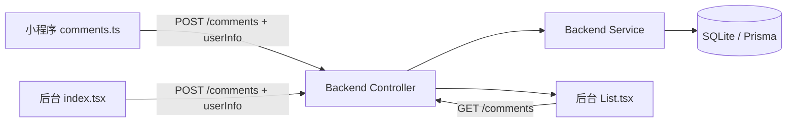

## 产品概述

在留言（评论）系统中新增用户信息记录功能，使小程序端提交留言时携带登录用户的昵称、头像和ID，后台管理系统能够展示这些用户信息。

## 核心功能需求

1. **后端数据库扩展**：Comment 模型新增 `userId`（Int）、`nickName`（String）、`avatarUrl`（String）三个可选字段
2. **后端 API 扩展**：创建和更新评论接口支持接收并存储用户昵称、头像、ID 字段
3. **小程序端改造**：

- 提交留言时通过 `getUserInfo()` 获取当前登录用户的 id/nickName/avatarUrl，一并发送到后端
- CommentItem 数据接口增加用户信息字段

4. **后台管理系统改造**：

- 留言列表表格增加"用户"列，显示用户头像+昵称
- 新增留言时从 localStorage 的 `user` 值中获取当前管理员的用户名/ID 一并传入（后台端 user 为 localStorage 存储的管理员标识）
- 留言气泡页面（index.tsx）提交时也传入用户信息

## 技术栈

- **数据库 ORM**: Prisma + SQLite（现有）
- **后端框架**: NestJS（现有 TypeScript）
- **小程序端**: 微信小程序原生框架 + TypeScript（现有）
- **管理后台**: React + Ant Design + UmiJS（现有）

## 实现方案

采用"字段直存"策略：在 Comment 模型中直接添加 userId/nickName/avatarUrl 三个冗余字段，避免关联查询复杂度。这是轻量级场景下的最优方案——无需建立 Comment 与 MpUser 的外键关系，读写性能更优，且兼容后台管理系统（后台 user 来源不同于 MpUser 表）。前后端保持字段命名一致（userId/nickName/avatarUrl），确保全链路数据透传。

### 关键技术决策

- **不建立外键关系**：后台管理系统的 user 来自 localStorage（非 MpUser 表），外键会限制灵活性
- **字段可选（?）**：历史数据和后台新增的留言可能无用户信息，所有新字段设为 Optional
- **小程序端复用已有 getUserInfo()**：auth.ts 中已封装完整的用户信息获取逻辑，直接调用即可
- **prisma migrate**：修改 schema 后需要执行迁移命令生成新的 client

### 数据流

```
小程序: submitComment -> getUserInfo() -> post('/comments', {content, userId, nickName, avatarUrl})
后台:  createComment -> localStorage.getItem('user') -> post('/comments', {content, nickName: userName})
后端:  Controller接收Body -> Service写入Prisma(含新字段) -> SQLite存储
后台列表:  getCommentList -> Table渲染含用户列(头像+昵称)
```

## 实现注意事项

- Prisma schema 修改后需执行 `npx prisma migrate dev --name add_comment_user_fields` 或 `npx prisma db push`
- 迁移完成后需重新生成 Prisma Client（`npx prisma generate`）
- 后台管理系统 localStorage 中 `user` 的值是字符串（如 `"admin"`），将其作为 nickName 传入；userId 可暂不传或使用固定值
- 小程序端 CommentItem 接口需同步更新，否则气泡动画构建时缺少字段可能导致类型报错
- 后台 List.tsx 新增的用户列应包含 Avatar 组件展示头像，配合昵称文字显示

## 架构设计（涉及改动的模块）



## 目录结构

```
# 后端改动
backend/
├── prisma/schema.prisma                          # [MODIFY] Comment模型新增userId/nickName/avatarUrl字段
├── src/comment/
│   ├── comment.controller.ts                     # [MODIFY] create/update Body类型扩展
│   └── comment.service.ts                        # [MODIFY] create/update方法传递新字段

# 小程序改动
app-yunyi/miniprogram/
└── pages/comments/comments.ts                    # [MODIFY] 提交时附带getUserInfo(); 接口扩展

# 管理后台改动
umi-blog/src/
├── services/comment.ts                           # [MODIFY] CommentItem类型扩展; createComment参数扩展
└── pages/Comment/
    ├── List.tsx                                  # [MODIFY] 表格新增用户列(头像+昵称); 新增弹窗传入user信息
    └── index.tsx                                 # [MODIFY] createComment传入当前登录用户信息
```