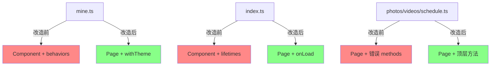

## 产品概述

修复微信小程序中 5 个页面文件的语法/架构问题，确保真机调试不再报 `SyntaxError: Unexpected token` 错误。

## 核心功能

- **photos.ts / videos.ts / schedule.ts**：这3个文件已使用 `Page(withTheme({...}))` 注册，但错误地将方法包裹在 `methods: {...}` 中（`Page()` 不支持 `methods` 包裹），需移除 `methods` 包裹，将方法提升为顶层属性
- **mine.ts**：当前使用 `Component({ behaviors, lifetimes, pageLifetimes, methods })` 形式注册页面，需改为 `Page(withTheme({...}))` 标准页面写法
- **index.ts**：当前使用 `Component({ lifetimes, methods })` 形式注册页面，需改为 `Page({...})` 标准页面写法

## 范围说明

- **需要修改**：5个 `.ts` 页面文件
- **无需修改**：`components/`、`behaviors/` 下的文件（它们使用 Component/Behavior，methods 是正确用法）
- **关键约束**：`withTheme()` 函数已内置对 `onLoad` / `onShow` 的包装和 `methods` 合并逻辑（见 theme.ts 第80-138行），但最佳实践是直接将方法写在顶层

## 技术栈

- 微信小程序原生开发（TypeScript）
- 项目路径：`e:\Project\app-yunyi\miniprogram\`

## 实现方案

### 问题根因

微信小程序中两种组件化方式的生命周期和方法组织方式不同：

| 特性 | Page() | Component() |
| --- | --- | --- |
| 方法位置 | 直接作为配置对象顶层属性 | 必须放在 `methods: {}` 中 |
| 生命周期 | onLoad, onShow, onUnload 等顶层 | lifetimes.attached/detached + pageLifetimes.show/hide |
| behaviors | 不支持（需用 withTheme 包装） | 支持 `behaviors: []` |


### 修复策略

#### 文件1-3：photos.ts / videos.ts / schedule.ts（移除 methods 包裹）

这三个文件当前结构：

```
Page(withTheme({
  data: {...},
  onLoad() {...},
  methods: {        // ← 删除此行
    methodA() {...},
    methodB() {...},
  },                // ← 删除此行的 },
}));                // ← 改为 }));
```

修复操作：删除 `methods: {` 和对应的闭合 `},`（保留方法内容不变）。

#### 文件4：mine.ts（Component → Page 转换）

当前结构分析：

```ts
// 当前 (错误)
import { themeBehavior } from "../../behaviors/theme";
Component({
  behaviors: [themeBehavior],          // → 改用 withTheme() 包裹
  data: {...},
  lifetimes: {                         // → attached 内容合并到 onLoad
    attached() { this._syncLoginState(); }
  },
  pageLifetimes: {                     // → show 内容改为 onShow
    show() { this._syncLoginState(); }
  },
  methods: { ... },                    // → 移除包裹，提升到顶层
});
```

改造要点：

1. import 改为 `{ withTheme }` from `"../../behaviors/theme"`
2. `Component({...})` → `Page(withTheme({...}))`
3. 移除 `behaviors: [themeBehavior]`（withTheme 已内置主题能力）
4. 移除 `lifetimes: { attached() {...} }` 和 `pageLifetimes: { show() {...} }` 对象结构
5. 将 `attached()` 中的 `_syncLoginState()` 调用放入新的 `onLoad()`
6. 将 `show()` 中的 `_syncLoginState()` 调用放入新的 `onShow()`
7. 移除 `methods: {}` 包裹，所有方法提升为顶层属性

注意：`withTheme()` 内部会包装用户的 `onLoad`/`onShow`，先调用 `computeTheme()` 再调用用户定义的函数，因此用户代码中不需要手动设置主题数据。

#### 文件5：index.ts（Component → Page 转换）

当前结构分析：

```ts
// 当前 (错误)
Component({
  data: {...},
  lifetimes: {
    attached() {
      // 从缓存或接口加载艺人列表
      let characters = getCachedArtists();
      // ...
    }
  },
  methods: {
    onCharSelect(e) { ... }
  }
});
```

改造要点：

1. `Component({...})` → `Page({...})`（index页无主题需求，不使用 withTheme）
2. `lifetimes.attached()` 的逻辑移入 `onLoad()`
3. 移除 `methods: {}` 包裹，`onCharSelect` 提升为顶层属性

### 验证方案

- TypeScript 编译无报错
- 微信开发者工具真机调试无 SyntaxError
- 各页面功能正常（方法可正确被 wxml 调用）

### 架构设计

