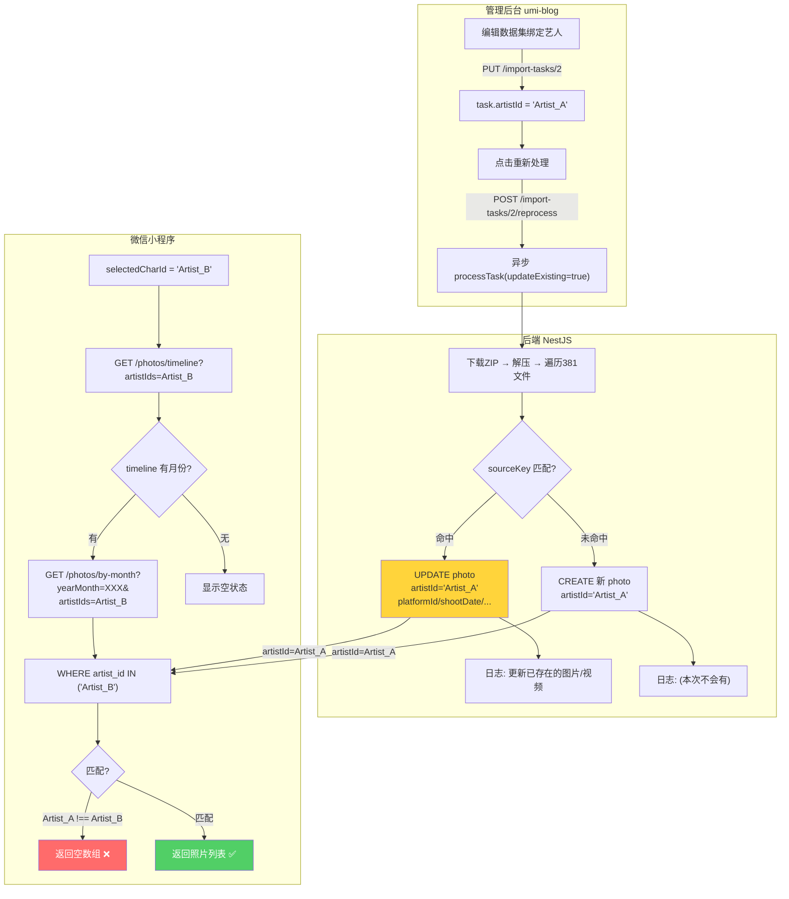

## Product Overview

修复 `POST /api/import-tasks/:id/reprocess` 重新处理后，微信小程序 `GET /api/photos/by-month` 照片列表不更新的问题。

**用户描述的核心现象**：

- 在管理后台（umi-blog）给数据集绑定艺人和平台后，点击"重新处理"按钮
- **之前正常**：照片成功绑定到对应艺人/平台；之前未入库的照片也会被解析出来
- **换成七牛云分片上传（ResumeUploader）后完全失效**：日志显示 381 success/0 failed，但照片列表无任何变化

## Core Features

- 诊断 reprocess 后 photos 表数据实际状态（artistId/deletedAt/shootDate/updatedAt）
- 定位并修复 reprocess 绑定失效的根因
- 确保 reprocess 后 photos/by-month 列表能正确反映更新后的数据
- 增强 reprocess 日志可观测性，便于后续排查类似问题

## Tech Stack

- **后端**: NestJS + Prisma ORM + MySQL（`e:/Project/backend`）
- **管理前端**: React + Ant Design + TypeScript（`e:/Project/umi-blog`）
- **小程序前端**: 微信原生小程序 + TypeScript（`e:/Project/app-yunyi/miniprogram`）
- **文件存储**: 七牛云 CDN（分片上传 ResumeUploader）

## 根因分析（基于完整代码审查）

### 已确认的完整数据流

```
管理员操作: 编辑数据集(绑定艺人) → 点击重新处理
  │
  ├─ PUT /import-tasks/2  { artistId: "xxx", artistName: "YYY" }
  │   → import_tasks.artist_id = "xxx"
  │
  └─ POST /import-tasks/2/reprocess
      → import-task.service.ts:260 reprocess()
        → 更新 task.updatedAt
        → 异步 processTask(2, undefined, true)   // updateExisting=true
          │
          ├── 行282: 从 DB 重新获取 task（含最新 artistId）
          ├── 行312-324: 从七牛下载 ZIP（reprocess 无 tempFilePath）
          ├── 行327: 解压 ZIP
          ├── 行334-359: 解析 JSONL 元数据 → noteMap
          │
          └── 行441-845: 遍历每个文件
              │
              ├── 行447-463: 正则提取 noteId
              │   标准: /^(images|videos)\/([^/]+)\/(.+)$/  → noteId=match[2]
              │   INS:  /^downloads\/([^/]+)\/([^/]+)\/(.+)$/ → noteId=match[2]
              │
              ├── 行485-516: 确定 artistId
              │   let artistId = task.artistId           // 手动绑定的艺人
              │   const useManualArtist = !!task.artistId // 如果绑定了艺人→跳过自动匹配
              │   if (note && !useManualArtist) { ...auto-match... }
              │
              ├── 行535: 构建 sourceKey = `${noteId}/${baseName}`
              │
              ├── 行537-608: 去重检查
              │   ├── sourceKey 存在 && 找到 existing 记录:
              │   │   └── updateExisting=true:
              │   │       UPDATE photo {
              │   │         artistId, photoPlatformId, shootDate,
              │   │         title, description, size,
              │   │         deletedAt: null (恢复软删除)
              │   │       }
              │   │       mediaId = existing.id     ← 不会创建新记录！
              │   │
              │   └── sourceKey 不存在 或 未找到记录:
              │       → mediaId 保持 null
              │
              └── 行611-694: if (!mediaId) → CREATE 新记录
                  上传七牛 → photo.create({ artistId, url, sourceKey, ... })
```

### 小程序端查询链路

```
photos.ts attached()
  ├── 行158: currentArtistId = app.globalData.selectedCharId
  ├── 行239-241: fetchPhotoTimeline({ artistIds: [currentArtistId] })
  │   → GET /photos/timeline?artistIds=xxx
  │   → WHERE deleted_at IS NULL AND artist_id IN (xxx)
  │   → 返回 [{ yearMonth, count }] 
  │
  └── 行296-440: loadMonth(yearMonth, index, currentArtistId)
      ├── 行305-307: 防重复检查
      │   if (_loadingMonths.has(yearMonth)) return;     // 正在加载中
      │   if (group.loaded || group.loading) return;     // 已加载过 → 跳过！
      │
      └── 行325-331: fetchPhotoList({
            yearMonth, page, pageSize,
            artistIds: artistId ? [artistId] : undefined,  // 关键过滤条件
            ...filterParams
          })
          → GET /photos/by-month?yearMonth=202606&artistIds=xxx
          → WHERE:
              deleted_at IS NULL
              AND shoot_date >= [月初] AND shoot_date < [月末]
              AND artist_id IN (xxx)    ← 可选但不为空时会严格过滤
```

### 按优先级排序的根因假设

| 优先级 | 假设 | 可能性 | 关键证据 |
| --- | --- | --- | --- |
| **P0** | **artistId 过滤不匹配** | **极高** | reprocess 将所有照片 artistId 设为 task.artistId（管理端绑定的艺人），但小程序查询用 selectedCharId。两者不一致则 findByMonth 返回空 |
| **P1** | **前端缓存未刷新** | 高 | `group.loaded=true` 导致已加载月份不再请求后端；需退出页面重入才触发全量重载 |
| **P2** | **分片上传导致首次导入全部成功** | 中高 | 旧上传方式可能部分大文件失败（无 DB 记录），reprocess 时会走 CREATE 分支"解析出新照片"；分片上传稳定后全部已存在，只 UPDATE 不 CREATE，无"新增"感 |
| **P3** | **shootDate 跨月偏移** | 低-中 | `extractShootDate()` 从 note 元数据取时间戳，同一 ZIP 数据不应变化 |


### 为什么"换分片后就失效"

**分片上传本身不影响数据处理逻辑**（uploadBufferToQiniu 只改变传输方式）。真正的影响链路是：

```
旧上传方式:
  首次导入 → 部分大文件上传失败 → 对应 photo 记录不存在
  repress → sourceKey 查不到 → 走 CREATE 分支 → 新记录出现 ✓
  用户感知: "没有在photo列表里的也解析出来了"

新分片上传:
  首次导入 → 所有文件都上传成功 → 381 条 photo 全部存在
  repress → sourceKey 全部命中 → 只走 UPDATE 分支 → 零新记录 ✗
  同时: artistId 被覆盖为 task.artistId
  如果 task.artistId ≠ 小程序 selectedCharId → 查询结果为空 ✗
  用户感知: "完全失效"
```

### 关键代码路径图



## 实施方案

### Phase 1: SQL 诊断（定位根因）

执行以下 SQL 确认数据实际状态：

```sql
-- (1) 任务当前状态和艺人绑定
SELECT id, status, artist_id, artist_name, updated_at, success_count, fail_count 
FROM import_tasks WHERE id = 2;

-- (2) reprocess 时间窗口内被更新的照片及其 artistId 分布
SELECT id, source_key, artist_id, photo_platform_id, 
       shoot_date, deleted_at, updated_at
FROM photos 
WHERE updated_at >= '2026-06-17 12:53:00' 
ORDER BY updated_at DESC LIMIT 30;

-- (3) 全部照片的 artistId 分布（确认是否有异常值或空值）
SELECT artist_id, COUNT(*) as cnt,
       SUM(CASE WHEN deleted_at IS NULL THEN 1 ELSE 0 END) as active_cnt
FROM photos GROUP BY artist_id ORDER BY cnt DESC;

-- (4) 模拟 findByMonth 查询（不带 artistIds 过滤）
SELECT COUNT(*) as total_without_filter 
FROM photos 
WHERE deleted_at IS NULL 
AND shoot_date >= '2026-01-01' AND shoot_date < '2027-01-01';

-- (5) 模拟带 artistIds 过滤（用任务绑定的 artistId）
-- 替换下面的 'ACTUAL_ARTIST_ID_FROM_STEP1'
SELECT COUNT(*) as total_with_task_artist 
FROM photos 
WHERE deleted_at IS NULL 
AND shoot_date >= '2026-01-01' AND shoot_date < '2027-01-01'
AND artist_id = 'ACTUAL_ARTIST_ID_FROM_STEP1';

-- (6) 软删除记录数（确认是否需要恢复）
SELECT COUNT(*) FROM photos WHERE deleted_at IS NOT NULL;
```

### Phase 2: 根据诊断结果修复

#### 如果 P0（artistId 不匹配）-- 最可能

**问题本质**: 管理端绑定的艺人 ID 与小程序当前选中的艺人 ID 不一致

**修复方案**（二选一或组合）:

方案A -- 后端增强: 在 reprocess 的更新路径中增加详细日志，记录前后 artistId 变化

```typescript
// import-task.service.ts 行 542-553 增强日志
if (updateExisting) {
    this.logger.log(`[Reprocess] UPDATE photo id=${existing.id} sourceKey=${sourceKey}: artistId '${existing.artistId}' -> '${artistId}', platformId ${existing.photoPlatformId} -> ${platformId}`);
}
```

方案B -- 前端修复: photos 页面支持查看所有艺人（或不传 artistIds 时展示全部）

#### 如果 P0+P1 组合（最常见场景）

需要在后端和前端同时修改：

1. **后端**: reprocess 增加 `updatedCount` / `createdCount` 统计返回值
2. **前端**: 增加"强制刷新"机制或轮询 reprocess 完成后自动刷新

#### 如果 P2（设计局限）: 需要新增 force-reprocess

当用户期望"删除旧记录 + 重新导入"语义时，当前 reprocess（只更新不增删）无法满足。
可选方案: 新增 `POST /import-tasks/:id/reprocess?force=true` 参数，
在 processTask 开始时先删除该批次的所有已有记录，再重新创建。

### Phase 3: 代码增强（无论根因为何均建议实施）

#### 文件清单

| 文件路径 | 操作 | 改动说明 |
| --- | --- | --- |
| `backend/src/import-task/import-task.service.ts` | MODIFY | 增强 reprocess/processTask 日志；增加统计计数器 |
| `miniprogram/pages/photos/photos.ts` | MODIFY | 增加强制刷新能力（下拉刷新重置 loaded 状态） |
| `miniprogram/pages/photos/photos.json` | MODIFY | 启用 `enablePullDownRefresh`（如果尚未启用） |


#### 关键改动点详情

**改动1: import-task.service.ts -- 增强日志**

位置: 行 541-607 (去重/更新分支)

新增内容:

- 在 updateExisting=true 分支增加详细 diff 日志（old artistId -> new artistId）
- 在 processTask 结束时输出统计摘要（updatedCount vs createdCount vs skippedCount）
- 在 sourceKey 为 null 时记录警告（这些文件永远走 CREATE 分支）

**改动2: photos.ts -- 强制刷新**

位置: loadPhotosFromServer 方法前增加 reset 缓存方法

新增内容:

```typescript
/** 重置所有缓存状态，强制下次访问时重新拉取 */
resetCache() {
  const self = this as unknown as PhotosInstance;
  self._allTimelineItems = undefined;
  self._loadingMonths = new Set();
  // 不直接清 groupedPhotos（避免闪烁），而是标记 loaded=false
  const groups = this.data.groupedPhotos;
  if (groups) {
    groups.forEach(g => { g.loaded = false; g.loading = false; });
  }
}
```

并在 onPullDownRefresh 生命周期中调用此方法。

## Agent Extensions

### SubAgent

- **code-explorer**
- Purpose: 在修复过程中验证改动不会影响其他功能（如首次导入、视频处理、Instagram 格式处理等分支路径）
- Expected outcome: 确认所有 code path（updateExisting true/false、isPhoto/isVideo、标准格式/Instagram 格式）在修改后仍能正确工作