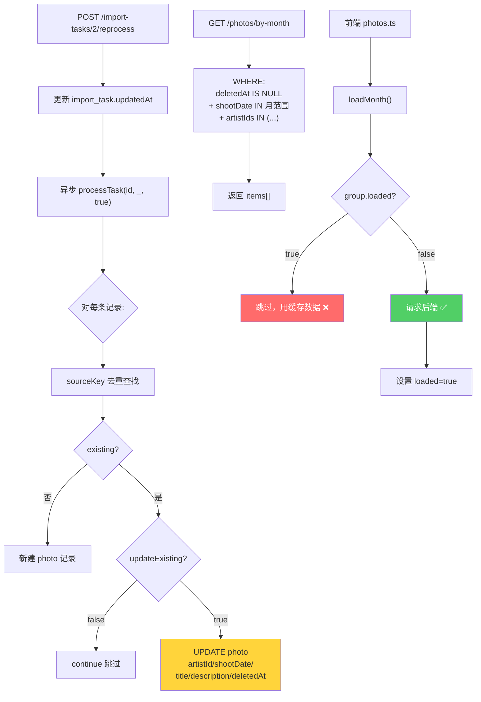

## Product Overview

排查并修复调用 `POST /api/import-tasks/2/reprocess` 重新处理导入任务后，`GET /api/photos/by-month` 照片列表未更新的问题。日志显示任务已完成（381 success, 0 failed），视频 PFOP 转码也成功，但前端照片列表无变化。

## Core Features

- 诊断 reprocess 后 photos/by-month 数据不显示的根因
- 通过 SQL 查询验证数据状态（deletedAt、shootDate、artistId 字段）
- 根据诊断结果修复后端或前端代码
- 确保 reprocess 完成后前端能正确展示更新后的数据

## Tech Stack

- **后端**: NestJS + Prisma ORM + MySQL，位于 `e:/Project/backend`
- **前端**: 微信小程序（TypeScript），位于 `e:/Project/app-yunyi/miniprogram`
- **文件存储**: 七牛云 CDN

## 根因分析

### 已确认的代码行为

**1. reprocess 执行流程** (`import-task.service.ts:260-277`)

```
reprocess(taskId) 
  → 更新 import_task.updatedAt
  → 异步调用 processTask(taskId, undefined, updateExisting=true)  // 不阻塞响应
  → 立即返回 { success: true, message: "重新处理已启动" }
```

**2. processTask 对已有 Photo 的处理逻辑** (`import-task.service.ts:541-607`)

```
按 sourceKey = noteId/baseName 去重查找已有记录
├── 找到记录 AND updateExisting=true:
│   → 更新字段: artistId, photoPlatformId, shootDate, title, description, size
│   → 如果 deletedAt 有值 → 恢复为 null（取消软删除）
│   → prisma.photo.update()  // 只更新，不新建、不删除
│   → 日志: "更新已存在的图片: xxx"
├── 找到记录 AND updateExisting=false:
│   → continue 跳过
└── 未找到记录:
    → 新建记录（上传七牛 → 入库）
```

**3. findByMonth 查询条件** (`photo.service.ts:429-432`)

```typescript
const where = {
  deletedAt: null,                    // 排除软删除记录
  shootDate: { gte: start, lt: end }, // 按月份范围过滤
};
// 可选过滤: artistIds, typeIds, locationIds, platformIds
// 无服务端缓存，每次实时查询
```

**4. 前端缓存机制** (`photos.ts:305-307`)

```typescript
if (self._loadingMonths?.has(yearMonth)) return;        // 防重复请求
if (!group || group.loaded || group.loading) return;     // 已加载则跳过
// loadMonth 成功后设置 group.loaded = true（行398）
// 之后同一月份不会重新请求后端
```

### 按可能性排序的根因假设

| 优先级 | 假设 | 可能性 | 说明 |
| --- | --- | --- | --- |
| **P0** | **前端缓存：页面未强制刷新** | 高 | `group.loaded=true` 导致已加载月份不再请求后端；用户 reprocess 后仍在看旧数据 |
| **P1** | **artistId 变化导致被筛选过滤** | 中高 | reprocess 使用 `task.artistId`（行485）；若任务绑定的 artistId 变更，照片被重分配到其他艺人；前端传 `artistIds` 过滤（行329），不匹配则不显示 |
| **P2** | **shootDate 变化导致跨月移动** | 低 | 同一 ZIP 元数据不变，shootDate 应相同；除非 `extractShootDate()` 逻辑有变更 |
| **P3** | **设计预期偏差：reprocess 只更新不新增** | 中 | reprocess 本质是元数据修正（artistId/shootDate/title 等），不会新增记录也不会改变总数；如果用户期望看到"新"照片，当前设计不支持 |


### 关键代码路径图



## 实施方案

### Phase 1: SQL 诊断（定位根因）

执行以下 SQL 验证数据状态：

```sql
-- ① 确认任务状态和艺人绑定
SELECT id, status, artist_id, artist_name, updated_at, success_count, fail_count 
FROM import_tasks WHERE id = 2;

-- ② 确认关联的照片 shootDate 分布（检查是否跨月）
SELECT 
  DATE_FORMAT(shoot_date, '%Y%m') as month,
  COUNT(*) as cnt,
  MIN(shoot_date) as earliest,
  MAX(shoot_date) as latest
FROM photos 
WHERE source_key IN (
  SELECT DISTINCT source_key FROM photos LIMIT 10000
)
GROUP BY DATE_FORMAT(shoot_date, '%Y%m')
ORDER BY month DESC;

-- ③ 确认 artistId 分布（检查是否被分配到不同艺人）
SELECT artist_id, COUNT(*) as cnt 
FROM photos 
WHERE deleted_at IS NULL
GROUP BY artist_id ORDER BY cnt DESC;

-- ④ 检查是否有软删除记录未被恢复
SELECT COUNT(*) as deleted_count FROM photos WHERE deleted_at IS NOT NULL;

-- ⑤ 直接测试 findByMonth 查询（不带任何可选过滤）
SELECT COUNT(*) FROM photos 
WHERE deleted_at IS NULL 
AND shoot_date >= '2024-01-01' 
AND shoot_date < '2028-01-01';

-- ⑥ 对比 reprocess 前后数据（如果有备份或 updatedAt 时间戳）
SELECT id, source_key, artist_id, shoot_date, updated_at, deleted_at
FROM photos 
WHERE updated_at >= '2026-06-17 12:53:00' 
ORDER BY updated_at DESC 
LIMIT 20;
```

### Phase 2: 根据诊断结果的修复策略

**如果根因是 P0（前端缓存）**：

- 用户行为层面：退出照片页再进入即可触发全量重新加载
- 代码增强（推荐）：为 reprocess 场景添加主动刷新机制

**如果根因是 P1（artistId 不匹配）**：

- 检查 `import_tasks.id=2.artist_id` 当前值
- 确认前端筛选的 artistId 与之匹配
- 如需支持多艺人查看：修改前端筛选逻辑或后端查询条件

**如果根因是 P3（reprocess 设计局限）**：

- 当前行为符合设计：只更新元数据，不增删记录
- 如果需要"重新导入"语义：需新增 `forceReimport` 方法，先删后插

### Phase 3: 代码增强建议（无论根因为何）

#### A. 后端：reprocess 返回值增加状态信息

**文件**: `e:/Project/backend/src/import-task/import-task.service.ts` (行 260-277)

- 让 reprocess 返回当前 task 状态，方便前端轮询确认完成

#### B. 前端：增加下拉刷新强制重载机制

**文件**: `e:/Project/app-yunyi/miniprogram/pages/photos/photos.ts`

- 在 `onPullDownRefresh` 中重置 `_allTimelineItems` 和 `groupedPhotos` 的 `loaded` 状态
- 确保刷新时重新请求 timeline + by-month

## 关键文件清单

| 文件 | 类型 | 说明 |
| --- | --- | --- |
| `backend/src/import-task/import-task.service.ts` | [MODIFY] | reprocess/processTask 核心，行260-277, 534-607 |
| `backend/src/photo/photo.service.ts` | [READ-ONLY] | findByMonth 查询逻辑，行407-457 |
| `miniprogram/pages/photos/photos.ts` | [MODIFY] | 前端加载/缓存逻辑，行234-440 |
| `miniprogram/services/api.ts` | [READ-ONLY] | API 定义 |


## Agent Extensions

### SubAgent

- **code-explorer**
- Purpose: 在实施修复前深入探索后端 reprocess 流程中可能遗漏的边界情况（如 sourceKey 为空时的处理、事务提交时机等）
- Expected outcome: 确认所有可能的失败路径已被覆盖，避免修复引入新问题