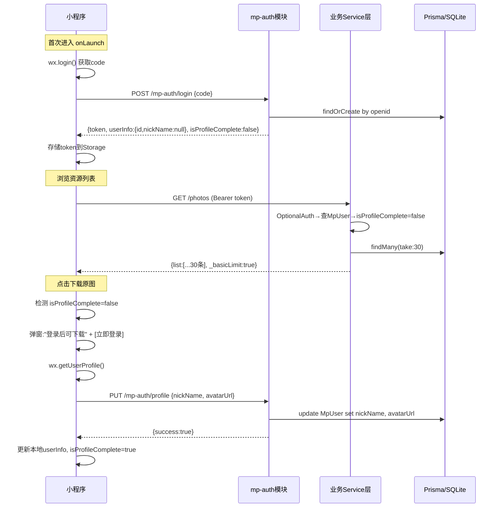

## 产品概述

重构小程序用户认证体系：将原有的"游客 vs 登录用户"二元模式改造为"基础用户 vs 正式用户"模式。核心原则是"游客不等于匿名"——首次进入即通过 wx.login 静默登录获取身份（openid），后端创建/查找用户并返回 token，所有请求均携带 token。区分用户等级的唯一标准是是否完善了个人资料（nickname 和 avatar），而非是否有 token。

## 核心功能

### 用户状态定义

- **基础用户**（Basic）：有 openid、有 token，但 nickName/avatarUrl 为 null。可浏览部分资源，列表限制返回 30 条，禁止查看原图/下载/留言
- **正式用户**（Formal）：有 openid、token 且已完善 nickName + avatarUrl。开放全部功能，无条数限制

### 后端改动

1. **新增接口**：PUT `/mp-auth/profile` —— 接收 nickName + avatarUrl，更新用户资料
2. **改造 OptionalAuth 装饰器**：从返回 `{ userId, openId } | null` 升级为 `{ userId, openId, isProfileComplete } | null`，通过查询数据库判断 nickName 是否为空
3. **统一修改所有 Service 层的游客限制逻辑**：

- 判断条件：`!user` → `user && !user.isProfileComplete`（即"有 token 但未完善资料"）
- 限制条数：50 → 30
- 涉及模块：Audio、Photo、Video（含 findAll + findByMonth）、PhotoCard、Sync

4. **Video Controller 的 findAll 接口**补上 OptionalAuth（目前遗漏）
5. **Comment 接口增加 MpAuthGuard 保护**：留言必须为正式用户
6. **login 接口返回值增强**：携带 `isProfileComplete` 字段，前端据此判断当前状态
7. **不影响后台管理系统**：后台使用独立认证体系（非 MpAuthGuard），本次改动仅涉及 @OptionalAuth() 和 @UseGuards(MpAuthGuard) 路由

### 前端改动

1. **onLaunch 自动静默登录**：启动时自动执行 wx.login() → POST /mp-auth/login → 存储 token（无需用户操作）
2. **auth.ts 新增 `completeProfile()` 方法**：调用 wx.getUserProfile() 获取头像昵称 → PUT /mp-auth/profile 更新资料 → 更新本地缓存
3. **受限功能拦截 UI**：当基础用户点击"查看原图"/"下载"/"留言"时，弹出提示框"登录后可下载"，点击"立即登录"触发 `completeProfile()`
4. **login 接口响应处理**：根据返回的 isProfileComplete 设置全局状态

## 技术栈

- **后端框架**：NestJS + Passport (JWT Strategy)
- **ORM**：Prisma + SQLite（MpUser 模型已有 nickName/avatarUrl 可选字段，无需改 schema）
- **前端**：微信原生小程序（TypeScript）

## 实现方案

### 核心策略

采用 **渐进式身份升级模型**（Progressive Identity Elevation）：

```
首次进入 → wx.login(静默) → code → 后端换 openid → 创建/查找 MpUser(nickName=null) → 返回 JWT → 前端存储
                                                                    ↓
                                                            标记为"基础用户"
                                                            (isProfileComplete=false)
                                                                    ↓
                                              用户点击受限功能 → 弹窗引导 → wx.getUserProfile()
                                                                    ↓
                                              PUT /mp-auth/profile → 更新 nickName+avatarUrl
                                                                    ↓
                                                            升级为"正式用户"
                                                            (isProfileComplete=true)
```

### 关键技术决策

1. **OptionalAuth 装饰器增强方案**：在装饰器内部验证 token 后，额外查询一次 MpUser 表获取 nickName 状态。由于装饰器是参数级的（非路由级），每次调用仅多一次 DB 查询（按主键 id 查找，性能可忽略）。替代方案是在 JwtStrategy validate 中直接返回完整用户信息——但这样会改变 request.user 的结构，影响面更大。因此选择在 OptionalAuth 内部补充查询。

2. **Service 层判断逻辑统一**：将 `const isGuest = !user;` 统一替换为 `const isBasic = user && !user.isProfileComplete;`。注意：无 token 的真正游客仍然被当作最严格限制（与基础用户同等对待）。实际上对于小程序场景，onLaunch 就会静默登录，所以 `user === null` 的情况极少。

3. **GUEST_LIMIT 常量提取**：各 Service 中分散定义的 `GUEST_LIMIT = 50` 统一改为 `BASIC_USER_LIMIT = 30`，保持一致性。

4. **向后兼容保障**：

- 后台管理系统的 Admin 认证走独立的 Guard/Strategy，完全不经过 MpAuthModule，不受影响
- 所有改动仅影响使用了 `@OptionalAuth()` 或 `@UseGuards(MpAuthGuard)` 的小程序专用路由
- 原有的 `@CurrentUser()` 装饰器行为不变（仍返回 request.user）

## 架构设计

### 数据流架构



## 目录结构与文件改动清单

```
e:/Project/backend/src/
├── mp-auth/
│   ├── dto/
│   │   └── update-profile.dto.ts        # [NEW] 完善资料 DTO { nickName, avatarUrl }
│   ├── mp-auth.controller.ts            # [MOD] 新增 PUT /profile 路由
│   ├── mp-auth.service.ts               # [MOD] login 返回 isProfileComplete；新增 updateProfileFromWx 方法
│   └── optional-auth.decorator.ts       # [MOD] 返回值增加 isProfileComplete 字段
├── audio/audio.service.ts               # [MOD] findAll/findByMonth 改用 isProfileComplete 判断，limit=30
├── photo/photo.service.ts               # [MOD] findAll/findByMonth 同上
├── video/
│   ├── video.controller.ts              # [MOD] findAll 补充 @OptionalAuth()
│   └── video.service.ts                 # [MOD] findAll/findByMonth 同上
├── photo-card/photo-card.service.ts     # [MOD] findAllCards 同上
├── sync/sync.service.ts                 # [MOD] getSocialPosts 同上
├── comment/
│   ├── comment.controller.ts            # [MOD] create 增加 @UseGuards(MpAuthGuard)
│   └── comment.service.ts               # [MOD] create 校验用户是否为正式用户
└── prisma/schema.prisma                # [NO CHANGE] MpUser 已有 nickName/avatarUrl 字段

e:/Project/app-yunyi/miniprogram/
├── app.ts                               # [MOD] onLaunch 增加静默登录调用
├── utils/auth.ts                        # [MOD] 新增 silentLogin()/completeProfile()；MpUserInfo 加 isProfileComplete
├── components/                          # [MOD] 受限功能弹窗组件（原图/下载/留言拦截）
│   └── auth-prompt/                     # [NEW] 登录引导弹窗组件
│       ├── auth-prompt.ts
│       ├── auth-prompt.wxml
│       └── auth-prompt.wxss
└── pages/
    ├── photos/photos.ts                  # [MOD] 原图预览加权限检查
    ├── videos/videos.ts                  # [MOD] 下载按钮加权限检查
    └── comments/comments.ts             # [MOD] 发言前检查权限
```

## 关键代码结构

### OptionalAuth 装饰器新签名

```typescript
// optional-auth.decorator.ts - 返回值类型变更
export const OptionalAuth = createParamDecorator(
  async (_data: unknown, ctx: ExecutionContext): Promise<{
    userId: number;
    openId: string;
    isProfileComplete: boolean;  // 新增：nickName !== null && avatarUrl !== null
  } | null> => {
    // ...现有 token 验证逻辑...
    // 新增：验证成功后查询 MpUser.nickName 判断资料完整性
    if (payload) {
      // 复用 PrismaService 按 userId 查询 nickName
      return { userId: payload.sub, openId: payload.openId, isProfileComplete: /* db query */ };
    }
    return null;
  },
);
```

### 完善资料 DTO

```typescript
// dto/update-profile.dto.ts
export class UpdateProfileDto {
nickName: string;
avatarUrl: string;
}

## 设计风格定位

采用深色沉浸式设计风格（Dark Immersive），契合小程序已有的黑色导航栏和暗色主题基调（navigationBarBackgroundColor="#000000"）。

## 页面规划

共涉及 3 个核心页面 + 1 个全局弹窗组件：

### 页面1：全局启动流程（app.ts onLaunch）

- **功能块**：启动时静默登录 + 状态初始化
- 无可见 UI 变化，纯逻辑层改动

### 页面2：图片详情页 —— 原图权限拦截

- **功能块-顶部导航栏**：页面标题 + 返回按钮（不变）
- **功能块-图片展示区**：大图预览（不变）
- **功能块-操作栏**：底部"保存到相册"/"查看原图"按钮区域。当用户为**基础用户**时，点击触发登录引导弹窗
- **功能块-登录引导弹窗（auth-prompt 组件）**：
- 居中弹出半透明毛玻璃卡片
- 图标 + 标题："登录后解锁全部功能"
- 描述文字："完善资料后即可下载原图、高清视频及更多内容"
- 主按钮："立即登录"（调用 wx.getUserProfile + 更新资料）
- 取消按钮："以后再说"

### 页面3：视频列表/详情页 —— 下载权限拦截

- **功能块-视频卡片列表**：正常展示缩略图和信息
- **功能块-下载/分享操作区**：点击下载按钮时检测用户状态，基础用户则弹出同款登录引导弹窗

### 页面4：评论区 —— 留言权限拦截

- **功能块-评论输入框**：底部固定输入区域
- **功能块-权限拦截**：基础用户点击输入框时，弹出登录引导弹窗（文案调整为"登录后即可参与讨论"）

## Agent Extensions

### SubAgent

- **code-explorer**
- Purpose: 在实现过程中深度搜索所有使用 `GUEST_LIMIT`、`isGuest`、`OptionalAuth` 的代码位置，确保不遗漏任何需要修改的 service 文件或 controller
- Expected output: 完整的受影响代码位置清单，包含文件路径、行号、具体代码片段