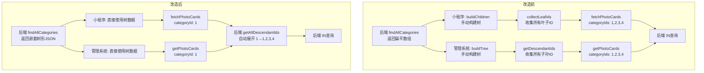

## Product Overview

将小卡分类从"扁平列表 + 前端手动构建树 + 收集所有叶子ID传给后端"的模式，改为"后端直接返回树形结构 + 传入单个categoryId后端自动查询所有子孙分类"的真正树级模式。核心目标：前端只需传当前选中节点的单个 ID，后端自动展开该节点及其所有子孙节点进行小卡筛选。

## Core Features

- **后端 `findAllCategories()` 改造**: 从返回扁平数组改为返回嵌套树形结构（含 children 字段）
- **后端 `findAllCards()` 改造**: 新增递归获取子孙分类 ID 的逻辑；当传入单个 `categoryId` 时自动展开为所有子孙 ID 的 `IN` 查询
- **小程序 cards 页面简化**: 移除手动构建树的 `buildChildren()`、收集叶子 ID 的 `collectLeafIds()`；`fetchPhotoCards` 参数从 `categoryIds: number[]` 改为 `categoryId: number`
- **管理系统 PhotoCardsMgt 主页简化**: 移除 `buildTree()` 函数（后端已返回树）；移除 `getDescendantIds()` 前端收集逻辑；`loadCards` 只传单个 `categoryId`
- **管理系统 Add 页面简化**: 移除手动构建 TreeSelect 树的逻辑
- **API 服务层适配**: 管理系统和小程序的 API 类型定义同步更新

## Tech Stack

- **后端**: NestJS + Prisma (已有项目)
- **小程序**: 微信原生小程序 TypeScript (已有项目)
- **后台管理系统**: React + Ant Design + UmiJS + TypeScript (已有项目)

## Implementation Approach

### 总体策略：后端承担树构建和子孙 ID 展开，前端大幅简化

核心思路是让后端成为"唯一的真相源"：

1. **后端 `findAllCategories()` 直接返回嵌套树形 JSON**（带 `children[]`），不再返回扁平列表
2. **后端新增 `getDescendantCategoryIds(categoryId)` 方法**：通过 Prisma 递归查询（或内存中遍历全量数据）获取某节点下所有子孙 ID
3. **后端 `findAllCards()` 中**：当收到 `categoryId` 参数时，调用上述方法拿到所有子孙 ID，再执行 `WHERE categoryId IN (...)` 查询
4. **所有前端**：删除手动的树构建 / 叶子ID收集逻辑，只传当前选中的单个 ID

### 关键技术决策

**决策1：子孙 ID 获取方式 — 全量加载 vs 递归 SQL**

- 方案A：先 findMany 所有分类到内存 → 递归遍历找子孙 → IN 查询小卡（推荐，简单可靠，分类数量通常 <1000）
- 方案B：使用 Prisma 的递归 CTE（复杂度高，且 SQLite/部分数据库支持有限）
- **选择方案A**：分类表数据量极小，全量加载开销可忽略，且兼容性好

**决策2：是否保留 `categoryIds` 参数向后兼容**

- **保留但不推荐**：`categoryIds` 参数保留在 Controller/Service 层但标记为 deprecated，优先使用新的单 `categoryId` 自动展开方式。这样可以避免一次性改动的爆炸半径过大

### 数据流变化对比

```
// === 改前 ===
前端: 选中父节点 → getDescendantIds() 收集 [1,2,3,4] → 传 categoryIds="1,2,3,4"
后端: WHERE categoryId IN (1,2,3,4)

// === 改后 ===
前端: 选中父节点 → 传 categoryId=1
后端: categoryId=1 → getAllDescendants(1) → 得到 [1,2,3,4] → WHERE categoryId IN (1,2,3,4)
```

## Implementation Details

### 后端改造 (backend/src/photo-card/photo-card.service.ts)

#### 1. `findAllCategories()` 改造

```typescript
async findAllCategories() {
  const flat = await this.prisma.photoCardCategory.findMany({
    orderBy: [{ sortOrder: 'asc' }, { createdAt: 'desc' }],
  });
  // 在 service 内部构建树并返回
  return this.buildTree(flat);
}

private buildTree(flat: any[]): any[] {
  const map = new Map<number, any>();
  const roots: any[] = [];
  flat.forEach((item) => map.set(item.id, { ...item, children: [] }));
  flat.forEach((item) => {
    const node = map.get(item.id)!;
    if (item.parentId != null && map.has(item.parentId)) {
      map.get(item.parentId)!.children!.push(node);
    } else { roots.push(node); }
  });
  // 清理空 children 数组（可选）
  roots.forEach(node => this.cleanEmptyChildren(node));
  return roots;
}
```

#### 2. 新增 `getAllDescendantIds(categoryId)` 方法

```typescript
async getAllDescendantIds(categoryId: number): Promise<number[]> {
  const all = await this.prisma.photoCardCategory.findMany({ select: { id: true, parentId: true } });
  const ids: number[] = [categoryId];
  const collect = (pid: number) => {
    all.filter(c => c.parentId === pid).forEach(c => { ids.push(c.id); collect(c.id); });
  };
  collect(categoryId);
  return ids;
}
```

#### 3. `findAllCards()` 中 categoryId 处理改造

```typescript
// 当有 categoryId 时，自动展开为所有子孙 ID
if (params?.categoryId) {
  const descendantIds = await this.getAllDescendantIds(params.categoryId);
  where.categoryId = { in: descendantIds };
} else if (params?.categoryIds) {
  // 保留向后兼容
  ...
}
```

### 小程序改造 (app-yunyi/miniprogram)

#### api.ts

- `fetchPhotoCards` 参数从 `{ categoryIds?: number[] }` 改为 `{ categoryId?: number }`
- 移除 `.join(",")` 逻辑

#### cards.ts

- 删除 `buildChildren()` 方法（第70-77行），后端直接返回树
- 删除 `collectLeafIds()` 方法（第107-117行）
- `loadCards()` 大幅简化：
- 选"全部": 不传 categoryId（或传特殊值如 undefined，后端返回所有）
- 选中任意级: 只传当前选中的 `categoryId` 单个值
- 移除所有 leaf ID 收集逻辑

### 管理系统改造 (umi-blog)

#### photoCard.ts 服务层

- `PhotoCardCategory` 接口增加 `children?: PhotoCardCategory[]`
- `getPhotoCards` 调用参数改为传 `categoryId?: number`

#### PhotoCardsMgt/index.tsx 主页

- **删除 `buildTree()` 函数**（第77-94行）：后端已返回树形数据
- **删除 `getDescendantIds()` 函数**（第97-117行）：不再需要前端收集
- **删除或简化 `findNode()` 函数**（第120-129行）：可能仍需要用于查找节点名称显示等
- **`flatCategories` → `treeCategories`**：state 名称变更，存储的已是树形数据
- **`filterCategoryIds` 计算简化**：从 `getDescendantIds(...)` 变为 `[selectedNodeId]`
- **`loadCards()` 参数简化**：从 `(categoryIds?, artistIds?)` 变为 `(categoryId?, artistIds?)`，内部只传 `categoryId`
- **`handleTreeSelect` 简化**：直接传选中的 nodeId 作为 categoryId
- **初始默认选中逻辑简化**（第435-447行）：无需计算 descendantIds
- **艺人切换 useEffect 简化**（第673-678行）：直接传 categoryId
- **删除处理**（第472-499行）：需改为后端提供批量删除接口 或逐个删除子孙（此逻辑可保持不变，因为删除操作仍然需要知道所有子孙 ID）

#### PhotoCardsMgt/Add.tsx 新增页

- **删除手动构建树逻辑**（第108-131行）：直接使用后端返回的树形数据转成 TreeSelect 格式（仅需简单的 title/value/key 映射）

### 影响范围汇总

| 文件 | 改动类型 | 改动内容 |
| --- | --- | --- |
| `backend/.../photo-card.service.ts` | **MODIFY** | findAllCategories 返回树; 新增 getAllDescendantIds; findAllCards 自动展开 |
| `backend/.../photo-card.controller.ts` | **MODIFY** | 可能调整类型声明（可选） |
| `app-yunyi/.../services/api.ts` | **MODIFY** | fetchPhotoCards 参数从 categoryIds[] 改为 categoryId |
| `app-yunyi/.../pages/cards/cards.ts` | **MODIFY** | 删除 buildChildren/collectLeafIds; 简化 loadCards |
| `umi-blog/.../services/photoCard.ts` | **MODIFY** | 接口增加 children; API 参数调整 |
| `umi-blog/.../pages/PhotoCardsMgt/index.tsx` | **MODIFY** | 删除 buildTree/getDescendantIds; 简化筛选/加载逻辑 |
| `umi-blog/.../pages/PhotoCardsMgt/Add.tsx` | **MODIFY** | 删除手动建树逻辑 |


## Architecture Design

### 改造前后架构对比



### 风险控制

- **向后兼容**：保留 `categoryIds` 参数在 Controller/Service 中，新旧客户端可共存
- **渐进式迁移**：先改后端（不影响现有前端），再逐一改各前端
- **删除操作不受影响**：管理系统的分类删除逻辑可保持不变（前端仍可用 getDescendantIds 来执行级联删除，或后续单独优化为后端级联删除接口）