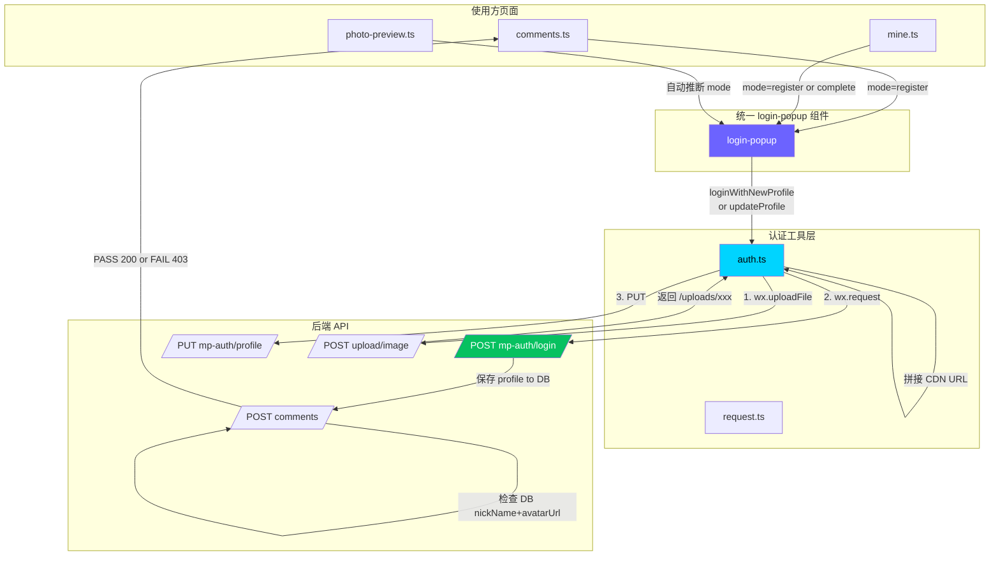

## 产品概述

修复小程序用户在调用 `POST /comments` 接口时被 403 拒绝的问题，同时统一三处登录/资料完善入口（comments、mine、photo-preview）为统一的 `login-popup` 组件。

## 核心功能

### 第一部分：修复 403 核心问题

- 修复后端登录接口丢失用户资料数据：前端发 `{ code, profile: { nickName, avatarUrl } }` 但后端 `LoginDto` 仅接收 `code`
- 实现头像持久化：`wxfile://tmp_...` 临时路径需先上传至七牛云获取永久 URL，再保存到数据库
- 确保 `comment.service.ts:29` 的 nickName/avatarUrl 校验通过

### 第二部分：统一 login-popup 组件

- 将 comments 和 mine 页面的内联登录弹窗 UI（头像选择 + 昵称输入）合并到 `login-popup` 组件
- 组件支持三种模式：`register`(未登录新注册)、`complete`(已登录缺资料)、`login`(纯静默兼容)
- photo-preview 从仅检查 `isLoggedIn()` 升级为同时检查 `isProfileComplete()`
- 三处使用方（comments/mine/photo-preview）统一引用 `<login-popup>`

## 问题根因链路

```
1. 前端 auth.ts:395 发送 { code, profile:{nickName, avatarUrl:"wxfile://tmp_..."} }
2. 后端 LoginDto 只有 code → profile 被静默丢弃
3. 即使接收了，wxfile:// 临时路径无法存入数据库
4. 数据库 avatarUrl=NULL → comment.service.ts:29 抛出 403
5. login-popup 当前 mode=login 只调静敏login()，不收集资料 → photo-preview 登录后仍无资料
```

## 改动范围总览

| 文件 | 操作 | 说明 |
| --- | --- | --- |
| `backend/src/mp-auth/dto/login.dto.ts` | 修改 | 新增可选 profile 字段 |
| `backend/src/mp-auth/mp-auth.service.ts` | 修改 | login() 中保存 profile 到 DB |
| `miniprogram/utils/auth.ts` | 修改 | loginWithNewProfile + updateProfile 增加头像预上传 |
| `miniprogram/components/login-popup/login-popup.wxml` | 修改 | 增加 register/complete 模式的表单 UI |
| `miniprogram/components/login-popup/login-popup.wxss` | 修改 | 迁移 comments 的弹窗样式 |
| `miniprogram/components/login-popup/login-popup.ts` | 修改 | 增加 register/complete 表单逻辑 |
| `miniprogram/pages/comments/comments.wxml` | 修改 | 内联弹窗替换为 `<login-popup>` |
| `miniprogram/pages/comments/comments.ts` | 修改 | 删除内联弹窗 data/methods |
| `miniprogram/pages/comments/comments.wxss` | 修改 | 删除已迁移的弹窗样式 |
| `miniprogram/pages/mine/mine.wxml` | 修改 | 内联编辑替换为 `<login-popup>` |
| `miniprogram/pages/mine/mine.ts` | 修改 | 删除内联编辑 data/methods |
| `miniprogram/pages/mine/mine.wxss` | 修改 | 删除已迁移的编辑样式 |
| `miniprogram/components/photo-preview/photo-preview.ts` | 修改 | 升级登录检测 + 传 mode 给 login-popup |
| `miniprogram/components/photo-preview/photo-preview.wxml` | 修改 | 传 mode 属性给 login-popup |


## Tech Stack

- **后端**：NestJS + TypeScript + Prisma (SQLite)
- **文件存储**：七牛云 Qiniu（已有基础设施）
- **文件上传**：Multer + diskStorage（`POST /upload/image` 已有）
- **前端**：微信小程序原生 + TypeScript
- **认证**：JWT Bearer Token

## Implementation Approach

采用「**头像预上传 + 后端保存 + 组件统一」」三层策略：

### Layer 1: 后端接受并保存 profile 数据

`LoginDto` 增加 `profile?: { nickName?: string; avatarUrl?: string }` 可选字段。在 `MpAuthService.login()` 的 findOrCreate 用户之后、签发 JWT 之前，判断 if(dto.profile) 则执行 `prisma.mpUser.update({ where: { id: user.id }, data: { nickName: dto.profile.nickName, avatarUrl: dto.profile.avatarUrl } })`。

### Layer 2: 前端头像预上传到七牛云

在 `auth.ts` 新增 `uploadAvatarToQiniu(tempPath)` 工具函数：用 `wx.uploadFile` 调用 `POST /upload/image`（无需鉴权），返回值 `{ url: "/uploads/xxx" }` 拼接 CDN 域名得到永久 URL。

- `loginWithNewProfile()`: 在调 login API 前，先上传 avatar 获得永久 URL，再随 profile 发送
- `updateProfile()`: 同样先上传再调用 PUT /mp-auth/profile

### Layer 3: login-popup 组件统一改造

将 comments.wxml:68-124（含标题/副标题/头像选择按钮/昵称输入框/取消确认按钮）的完整 UI 迁移到 `login-popup` 组件中。组件根据 `mode` 属性切换：

- `mode="register"`: 显示完整表单(选头像+填昵称)，确认后调 `loginWithNewProfile()`
- `mode="complete"`: 显示完整表单，确认后调 `updateProfile()`
- `mode="login"`: 仅显示微信一键登录按钮（向后兼容）
- `mode="" 或不传`: 自动推断 — 未登录→register，已登录无资料→complete

### Layer 4: 三处页面统一引用

- **comments**: 删除 `showLoginPopup/tempAvatarUrl/tempNickName/onChooseAvatar/onNicknameInput/confirmLogin/onLoginCancel` 及对应 WXML/WXSS，改为 `<login-popup show="{{showLoginPopup}}" mode="register" bind:loginSuccess="onLoginSuccess" />`
- **mine**: 删除 `showProfileEdit/showNicknameEdit/tempAvatarUrl/tempNickName/onChooseAvatar/onNicknameInput/onConfirmProfile/onCancelEdit` 及对应 WXML 编辑区域，改为 `<login-popup show="{{showLoginPopup}}" mode="{{loggedIn ? 'complete' : 'register'}}" bind:loginSuccess="_syncLoginState" />`
- **photo-preview**: 引入 `isProfileComplete` 检测，`onViewOriginal`/`onDownload` 中未登录弹出 `mode="register"`，已登录但无资料弹出 `mode="complete"`

## Key Implementation Notes

- **CDN 域名**: `upload.controller.ts:89` 返回相对路径 `/uploads/xxx`，需拼接七牛 CDN 域名。方案：前端硬编码或在 request.ts 中定义常量 `const CDN_BASE = 'https://your-qiniu-cdn.com'`（从环境变量或项目配置读取）
- **BASE_URL 复用**: `request.ts:2` 定义了 `BASE_URL = 'http://192.168.10.37:3000'`，`wx.uploadFile` 需要用此地址
- **错误降级**: 头像上传失败时，`loginWithNewProfile` 降级为仅传昵称（avatarUrl 为空），用户后续可通过 updateProfile 补充
- **幂等性**: 重复带相同 profile 登录时 DB update 是幂等的
- **向后兼容**: LoginDto.profile 为可选字段，纯 code 静默登录完全不受影响
- **样式迁移**: comments.wxss:277-430 的弹窗样式整体迁移到 login-popup.wxss，保持暗色玻璃拟态风格一致
- **mine 特殊处理**: mine 页面的用户信息区域（avatar/nickname/welcome text）保留原位展示不变，仅编辑弹窗改为 login-popup

## Architecture Design



## Directory Structure

```
backend/src/
├── mp-auth/
│   ├── dto/
│   │   └── login.dto.ts              # [MODIFY] 新增可选 profile 嵌套对象
│   ├── mp-auth.service.ts            # [MODIFY] login() 增加 profile 持久化逻辑
│   └── mp-auth.controller.ts         # [NO CHANGE] 已支持 Body DTO 接收

miniprogram/
├── components/
│   └── login-popup/
│       ├── login-popup.json          # [NO CHANGE] 已有组件注册
│       ├── login-popup.wxml          # [MODIFY] 增加 register/complete 模式表单UI
│       ├── login-popup.wxss          # [MODIFY] 迁移 comments 弹窗样式 + 表单样式
│       └── login-popup.ts            # [MODIFY] 增加 form data + chooseAvatar + nickname + submit logic
├── utils/
│   └── auth.ts                       # [MODIFY] 新增 uploadAvatarToQiniu(), loginWithNewProfile/updateProfile 增加上传步骤
├── pages/
│   ├── comments/
│   │   ├── comments.wxml             # [MODIFY] 内联弹窗替换为 <login-popup>
│   │   ├── comments.ts               # [MODIFY] 删除重复弹窗 data/methods
│   │   └── comments.wxss             # [MODIFY] 删除已迁移的弹窗样式
│   └── mine/
│       ├── mine.wxml                 # [MODIFY] 内联编辑替换为 <login-popup>
│       ├── mine.ts                   # [MODIFY] 删除重复编辑 data/methods
│       └── mine.wxss                 # [MODIFY] 删除已迁移的编辑样式
└── components/
    └── photo-preview/
        ├── photo-preview.wxml         # [MODIFY] 传 mode 属性给 login-popup
        └── photo-preview.ts           # [MODIFY] 升级登录检测 + isProfileComplete 检查
```

## 设计概述

本次改动涉及两个层面的设计：后端纯逻辑层无需 UI 变更；前端需要重新设计 login-popup 组件以支持三种模式的表单交互，并统一 comments、mine、photo-preview 三处入口的视觉体验。

## 设计风格

沿用项目现有的 Dark Space 极简黑色主题，与 comments 弹窗的暗色玻璃拟态风格一致。核心设计元素包括：深色半透明遮罩（rgba(0,0,0,0.7)）、圆角卡片（#1a1a2e 底色 + 微光边框）、渐变主按钮（#6C63FF → #00D4FF）、圆形头像选择器（紫色边框高亮）、底部双按钮操作区。

## 页面规划（共 2 个核心界面）

### 界面 1: login-popup 统一弹窗组件

这是唯一需要设计的新界面，将替代当前分散在三处的不同实现。

**Block 1 - 遮罩层**: 全屏固定定位半透明黑色背景 rgba(0,0,0,0.75)，点击不关闭（强制操作）

**Block 2 - 弹窗卡片**: 600rpx 宽度居中圆角卡片，深色底 #141414（与现有 login-popup 一致），scaleIn 入场动画

**Block 3 - 标题区**: 装饰线（主题色 48rpx宽 4rpx高）+ 主标题（36rpx 600重 白色）+ 描述文字（26rpx 灰色）。文案根据 mode 动态切换：register="欢迎来到 StarView"/complete="解锁全部功能"

**Block 4 - 头像选择器**（仅 register/complete 模式显示）: 160rpx 圆形按钮 open-type="chooseAvatar"，4rpx 主题色边框，内嵌 140rpx 圆形头像预览图，底部悬浮"选择头像"/"点击更换"提示文字

**Block 5 - 昵称输入框**（仅 register/complete 模式显示）: 全宽圆角容器（rgba(255,255,255,0.06) 底 + 2rpx 微光边框），内部 88rpx 高 input[type=nickname]，白色文字，28rpx 字号

**Block 6 - 操作按钮区**:

- register/complete 模式: 双按钮横排（取消 + 确认），确认按钮渐变背景 disabled 态置灰
- login 模式: 单按钮（微信一键登录 + 图标），绿色背景 #07C160

**Block 7 - 取消链接**（login 模式）: 底部"以后再说"灰色文字链接

### 界面 2: photo-preview 登录状态联动

photo-preview 本身不做 UI 重构，但需要增强登录检测逻辑：

- 原: 只检查 isLoggedIn() → mode="login"
- 新: 检查 isLoggedIn() && isProfileComplete() → 自动决定 mode="register" 或 "complete"

## Agent Extensions

### SubAgent

- **code-explorer**
- Purpose: 在实施过程中深入探索相关文件的完整上下文，确认 import 路径、依赖关系和现有代码模式
- Expected outcome: 确保所有修改点与现有代码风格一致，避免遗漏依赖引入或类型导入