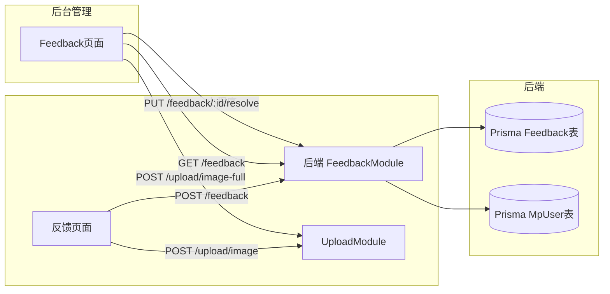

## 产品概述

问题反馈全链路功能，覆盖小程序端提交、后端存储管理、后台管理系统查看处理三个环节。

## 核心功能

### 小程序端（仅新增）

- 用户在反馈页面选择问题类型（从 `photo-feedback` 字典表获取）、填写问题描述、上传截图、填写联系方式
- 提交时携带当前登录用户身份（JWT token），后端关联 MpUser
- 新增反馈记录默认状态为"未解决"
- 图片上传走后端七牛云接口，提交时传图片 URL 而非本地临时路径

### 后端

- 新建 Feedback 模块，包含反馈记录的 CRUD 接口
- 新增 Prisma `Feedback` 模型，关联 MpUser，字段包含：问题类型、描述、图片、联系方式、状态、处理结果、处理内容、处理图片、备注、处理人
- 小程序提交接口需 JWT 认证（MpAuthGuard），自动关联当前用户
- 后台管理接口无认证（与现有 photo-tag 等模块一致），支持分页查询、查看详情、编辑、删除、解决操作

### 后台管理系统

- 反馈列表 Table，展示小程序用户信息（昵称、头像）、问题类型、描述、状态、提交时间
- 操作列：查看详情、编辑、删除、解决
- 点击"解决"弹出 Modal，填写处理结果、处理内容、上传图片、备注，提交后状态变为"已解决"
- 提交解决时携带 localStorage 中的 user（当前操作人）作为处理人

## Tech Stack

- **后端**: NestJS + Prisma (SQLite)，复用现有模块化模式（module/controller/service）
- **小程序**: 微信小程序原生开发，复用 `services/request.ts` 封装
- **后台管理**: Umi + React + antd + CSS Modules，复用 `umi-request` 和现有 service 模式

## Implementation Approach

### 后端方案

1. **Prisma 新增 Feedback 模型**：与 MpUser 关联（userId），存储完整反馈记录及处理信息。状态字段用枚举字符串 `unresolved` / `resolved`，默认 `unresolved`。
2. **新建 `src/feedback` 模块**：独立模块（不混入 photo-tag），包含 controller/service/module，遵循现有 NestJS 三层架构。导入 PrismaModule + MpAuthModule（复用 MpAuthGuard）。
3. **接口设计**：

- `POST /feedback` — 小程序提交（@UseGuards(MpAuthGuard) + @CurrentUser 获取 userId）
- `GET /feedback` — 后台分页查询（含 MpUser 关联信息）
- `GET /feedback/:id` — 查看详情
- `PUT /feedback/:id` — 编辑
- `DELETE /feedback/:id` — 删除
- `PUT /feedback/:id/resolve` — 解决操作（接收处理结果、处理内容、处理图片、备注、处理人）

4. **图片上传**：小程序端先调用现有 `POST /upload/image` 上传图片获取 URL，再随反馈数据提交。后台解决时同样用 `POST /upload/image` 上传处理截图。

### 小程序方案

1. 修改 `feedback.ts` 的 `submitFeedback`：先上传图片（如有），再 POST `/feedback` 提交完整数据。
2. 提交字段对齐后端：`type`（问题类型名称）、`description`、`image`（七牛云 URL）、`contact`。
3. 复用现有 `post` 方法，自动携带 JWT token。

### 后台管理方案

1. 新建 `src/services/feedback.ts`：定义接口类型和 API 方法（getList、getDetail、update、delete、resolve）。
2. 实现 `src/pages/Feedback/index.tsx`：参考 SwiperMgt 模式，Table + 分页 + Modal。
3. 解决 Modal：Form 包含处理结果（Select）、处理内容（TextArea）、上传图片（Upload + uploadImageFull）、备注（Input），提交时从 `localStorage.getItem('user')` 获取处理人。
4. 列表展示用户信息：头像（Image 组件 + getImageUrl）、昵称、问题类型（Tag）、状态（Tag 带颜色）、提交时间（formatDateTime）。

## Implementation Notes

- **Prisma migration**：新增 Feedback 模型后需执行 `npx prisma db push` 同步 SQLite schema。
- **性能**：列表查询使用 Prisma `include` 关联 MpUser，单次查询避免 N+1；分页用 `skip` + `take`。
- **向后兼容**：不修改现有 photo-feedback 字典表接口，Feedback 是独立新表。
- **图片路径**：后端返回相对路径（如 `/uploads/xxx`），前端用 `getImageUrl()` 拼接 CDN 前缀，小程序端也需拼接 CDN 前缀。
- **状态枚举**：`unresolved`（未解决）、`resolved`（已解决），前端用 antd Tag 颜色区分（红色/绿色）。

## Architecture Design



## Directory Structure

### 后端新增/修改文件

```
e:\Project\backend\
├── prisma\
│   └── schema.prisma                    # [MODIFY] 新增 Feedback 模型，关联 MpUser
├── src\
│   ├── feedback\                         # [NEW] 反馈记录模块
│   │   ├── feedback.module.ts            # [NEW] 注册 controller/service，导入 PrismaModule + MpAuthModule
│   │   ├── feedback.controller.ts        # [NEW] CRUD + resolve 接口，POST 用 MpAuthGuard
│   │   └── feedback.service.ts           # [NEW] Prisma 操作，含分页查询(include MpUser)、创建、更新、删除、解决
│   └── app.module.ts                     # [MODIFY] imports 数组新增 FeedbackModule
```

### 小程序修改文件

```
e:\Project\app-yunyi\miniprogram\
└── pages\
    └── feedback\
        └── feedback.ts                   # [MODIFY] submitFeedback 改为真实提交：先上传图片再 POST /feedback
```

### 后台管理新增/修改文件

```
e:\Project\umi-blog\
└── src\
    ├── services\
    │   └── feedback.ts                   # [NEW] 反馈 API service：getList/getDetail/update/delete/resolve
    └── pages\
        └── Feedback\
            ├── index.tsx                 # [MODIFY] 实现 Table + 分页 + 查看/编辑/删除/解决 Modal
            └── index.less                # [MODIFY] 样式，参考 SwiperMgt 暗色主题
```

## Key Code Structures

### Prisma Feedback 模型

```
model Feedback {
  id            Int      @id @default(autoincrement())
  userId        Int
  user          MpUser   @relation(fields: [userId], references: [id])
  type          String
  description   String
  image         String?
  contact       String?
  status        String   @default("unresolved") // unresolved | resolved
  resolveResult String?
  resolveContent String?
  resolveImage  String?
  resolveRemark String?
  resolvedBy    String?
  resolvedAt    DateTime?
  createdAt     DateTime @default(now())
  updatedAt     DateTime @default(now()) @updatedAt

  @@index([userId])
  @@index([status])
}
```

### 后台 Feedback Service 接口

```typescript
export interface FeedbackItem {
  id: number;
  userId: number;
  user: { id: number; nickName: string | null; avatarUrl: string | null };
  type: string;
  description: string;
  image: string | null;
  contact: string | null;
  status: 'unresolved' | 'resolved';
  resolveResult: string | null;
  resolveContent: string | null;
  resolveImage: string | null;
  resolveRemark: string | null;
  resolvedBy: string | null;
  resolvedAt: string | null;
  createdAt: string;
  updatedAt: string;
}

export interface FeedbackListResponse {
  list: FeedbackItem[];
  total: number;
}
```

## Agent Extensions

### SubAgent

- **code-explorer**
- Purpose: 在实现阶段探索后端现有模块的精确导入路径、Prisma schema 完整上下文、以及小程序上传图片的具体调用方式
- Expected outcome: 确保新增代码与现有模式完全一致，避免导入错误或模式偏差